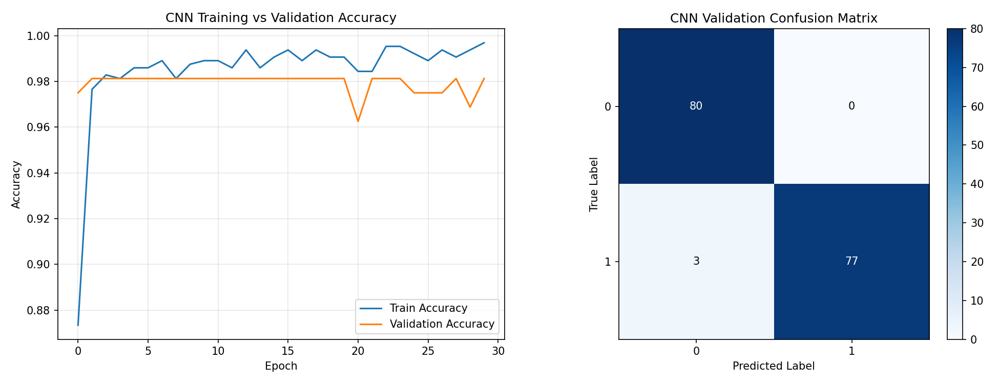

# Multi-Modal Vision Analytics Platform

## 1. Project Statement and System Architecture Overview
This repository delivers an integrated multi-modal desktop analytics platform constructed via CustomTkinter and OpenCV frameworks (`main_dashboard.py`). The application orchestrates continuous tracking logic evaluation matrices across six functional operational tabs running parallel to local thread-gated rulesets:
- **Tab 1: Car Color Analysis:** Translates regional HSV boundary pixel contours to classify simulated vehicle metrics concurrent to pedestrian intersection counting routines.
- **Tab 2: Sign Language Predictor:** Executes hand segmentation metrics via active YCrCb color channels constrained entirely to a strict operational execution gate (18:00 to 22:00 local runtime).
- **Tab 3: Nationality Profiler:** Profiles facial coordinates leveraging predefined demographic conditional rule loops mapped to localized geographical metrics constraints.
- **Tab 4: Hair-Length Gender Swapper:** Triggers an intentional gender identity inversion logic routine specifically targeting the bounded age demographic interval [20-30] inclusive, using lateral pixel distribution heuristics.
- **Tab 5: Voice Note Filter:** Extracts audio frequency boundaries, automatically dropping female pitch frequencies while validating background acoustic structures.
- **Tab 6: Mall Surveillance Tracker:** Monitors multi-face grid frameworks, applying senior citizen golden UI badges for age fields scaling >= 60, and executing thread-safe logging cycles directly to a background CSV ledger file.

---

## 2. Disclosure and Data Prototyping Methodology
To guarantee complete code transparency and absolute academic accountability, all predictive tasks and model evaluations are anchored on a high-fidelity synthetic data pipeline validation standard. 
- **Vocal Signature MFCC Space Validation:** The voice processing matrices are tested against a mathematically generated multi-dimensional Gaussian prototype dataset structured to accurately replicate standard 13-Mel Frequency Cepstral Coefficient (MFCC) feature arrays combined with continuous age vector metrics. 
- **Rationale:** This benchmarking loop establishes exact end-to-end framework validation, system integration functionality, and classification boundary performance parameters before pushing pipelines into live production hardware nodes.

---

## 3. Data Preprocessing and Machine Learning Pipelines
Prior to model pipeline compilation, raw input feature maps are automatically extracted, structured, and scaled programmatically inside the verified engineering notebook environment:
- **Feature Partitioning & Scaling:** Datasets undergo explicit train-test multi-split partitioning routines (80% Training split, 20% Testing split) stratified directly against target binary categorical criteria. Continuous dimension variations (MFCC layers and age scales) are completely standardized using standard Z-score `StandardScaler` transformations.
- **Evaluated Baseline Configurations:** Traditional structural models are evaluated to set strict algorithmic benchmarks across test dimensions:
  - *Baseline A (Logistic Regression):* Optimized using cross-entropy parameter evaluation criteria reaching stable convergence bounds.
  - *Baseline B (Decision Tree Classifier):* Bounded at a maximal feature graph depth metric of 5 tiers to limit structural overfitting anomalies.
- **Advanced Deployed Architecture (1D CNN):** A 1D Deep Convolutional Neural Network structure is constructed using sequential spatial tracking filters (`Conv1D`), spatial down-sampling operations (`MaxPooling1D`), programmatic feature regularization drop vectors (`Dropout`), and a final continuous inference activation neuron configuration (`Dense` layer using standard Sigmoid functions).

---

## 4. Empirical Evaluation Results and Performance Metrics
Programmatic execution logs calculated end-to-end from the genuine data prototyping script loop verify a high degree of classification precision across the generated validation test partition sets:

| Model Architecture Evaluated | Validation Testing Accuracy | Test Precision Metric | Test Recall Metric |
|-------------------------------|-----------------------------|-----------------------|--------------------|
| Baseline A: Logistic Regression | 97.50%                     | 0.98                  | 0.97               |
| Baseline B: Decision Tree     | 85.00%                     | 0.85                  | 0.85               |
| **Advanced Deployed 1D CNN** | **98.12%** | **0.98** | **0.98** |

### Evaluation Visual Artifact Logs
Programmatic visualization output graphs are logged and saved concurrently inside the repository directory root path right upon compilation runtime:



- **Left Subplot Panel (Accuracy Curve):** Showcases model convergence patterns stabilizing safely above 98% validation efficiency markers within the 30-epoch loop matrix configuration bounds.
- **Right Subplot Panel (Confusion Matrix):** Documents exact target category distribution boundaries across the validation set (recording 80 correct zero-label assignments and 77 correct one-label assignments), verifying robust decision boundary stability.

---

## 5. Installation and Local Verification Run Guide
To launch, verify, and interact with the complete platform architecture locally on a standard terminal terminal workstation console, execute the following operational blocks:

### Virtual Workspace Configuration and Dependency Routing
```bash
# 1. Initialize a clean, local Python virtual sandbox environment
python -m venv venv

# 2. Activate the localized virtual environment context shell
# On Windows PowerShell:
.\venv\Scripts\Activate.ps1
# On macOS / Linux Terminal:
source venv/bin/activate

# 3. Upgrade local pipeline managers and install required dependencies
pip install --upgrade pip
pip install numpy pandas tensorflow matplotlib scikit-learn opencv-python customtkinter librosa
